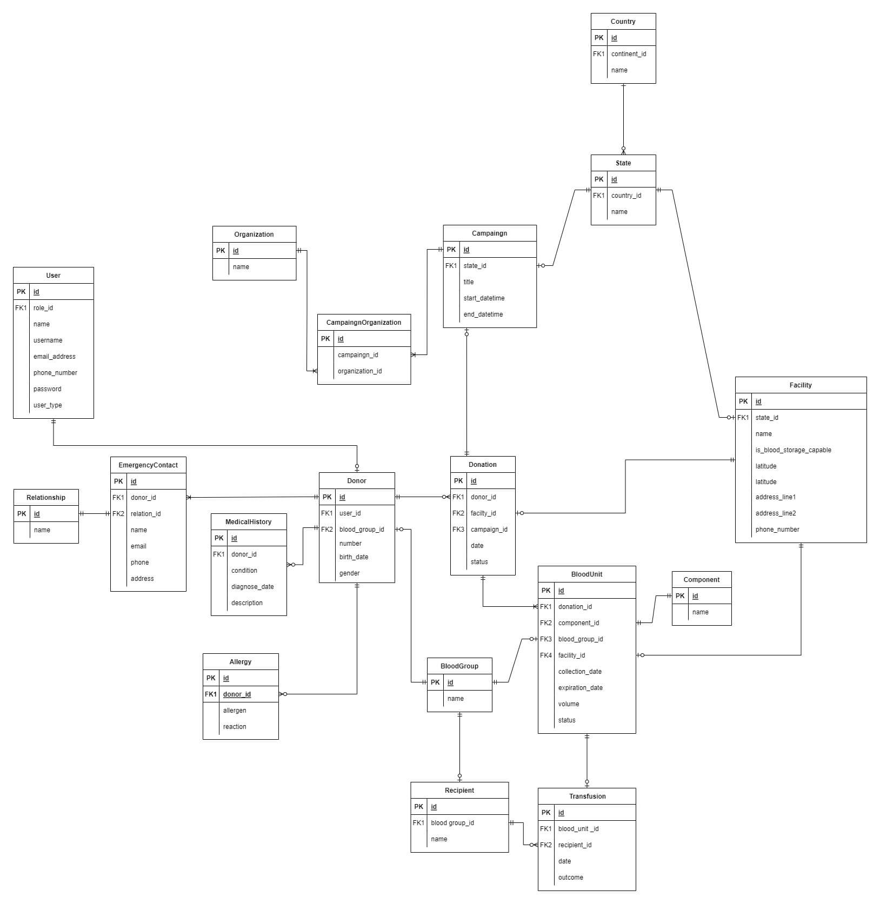

# Aka

## Introduction
The project aims to develop a comprehensive Blood Donation Management System that efficiently facilitates blood type matching, maintains donor health records, and ensures secure and user-friendly interaction between donors and administrators.

---
## Contextualization

### Why
#### Saving Lives: 
- The primary purpose of a blood bank is to save lives by providing a crucial supply of blood and its components to patients in hospitals and clinics.

#### Ensuring Blood Safety: 
-  Rigorous testing and screening protocols for all blood donations are in place to guarantee the safety of the recipients by preventing the transmission of blood-borne diseases like HIV, hepatitis, and syphilis.

#### Managing Blood Inventory: 
- The efficient management of diverse blood types is vital, ensuring an optimal inventory that aligns with the dynamic demand, ultimately meeting the diverse needs of patients.

#### Facilitating Donation: 
- Simplifying the blood donation process for donors is achieved through making it both convenient and informative, encouraging regular contributions to the blood bank.

#### Tracking and Recording Data: 
- The systematic recording and tracking of comprehensive information regarding donors, donations, and blood inventory serve purposes of reporting, analysis, and adherence to regulatory standards.

### Challenges
	
#### Fluctuating Inventories: 
- The challenge lies in maintaining consistent blood inventories due to the unpredictable nature of demand and the limited shelf life of blood products.

#### Accurate Screening and Testing: 
- Precision in blood screening tests is paramount to prevent the transmission of diseases, emphasizing the importance of accuracy in testing procedures.

#### Donation Awareness: 
- Addressing the continuous challenge of raising awareness about blood donation and motivating individuals to contribute regularly to the blood bank.

#### Data Integrity and Privacy: 
- Ensuring the integrity of data and safeguarding the privacy of donor information are critical aspects, especially in light of cybersecurity concerns. This involves adopting robust measures to protect against potential breaches and unauthorized access.

---

## Acthors
- Donor
- Staff

---

## Functional requirements

### Blood Type Matching:
- The system should facilitate the efficient matching of blood types between donors and recipients for blood transfusions.

### Health History Management:
- Maintain a comprehensive health history for each donor to assess eligibility for blood donation and ensure recipient safety.

### Notification System:
- Implement a notification system to alert donors about upcoming donation appointments, campaigns, and critical updates.

### Campaign Management:
- Enable administrators to create, manage, and track blood donation campaigns.
- Features include setting campaign goals, monitoring progress, and analyzing campaign effectiveness.

### Feedback Mechanism:
- Provide a way for donors to provide feedback on the donation process, system usability, and overall user experience.

---

## Non-functional requirements
### Security:
- Ensure the confidentiality of sensitive records.

### Performance:
- Optimize system performance for efficient data processing.

### Availability:
- Ensure the system is consistently available for users.

### Scalability:
- Design the system to scale to accommodate growing data and user volumes.

### Integration:
- Enable seamless integration with other relevant systems.

### Usability:
- Prioritize a user-friendly interface for both donors and administrators.

### Backup and Recovery:
- Implement robust backup and recovery mechanisms to prevent data loss.

### Donation Scheduling:
- Facilitate efficient scheduling of blood donations.

---

## Business rules

### Confidentiality:
- Ensure the confidentiality of sensitive records throughout the system.

### Authorization:
- Allow only authorized administrators to register or delete users (staff or donors).

### User Roles:
- Assign each user a specified role and a unique identifier.

### Donor Eligibility:
- Only eligible donors should be registered or allowed for blood donation if already registered.

### Donor Mobile Applicatio:
- Enable donors to access information about campaigns, manage non-sensitive personal information, and view blood donation history or status through a mobile app.

---

## Use Case Diagram

---

## Database

### ER Diagram

### Tables
- Country
- State
- user (donnor or staff)
- blood type
- donor
- MedicalHistory
- Allergies
- DonorEmergencyContact
- DonorEmergencyContactRelationship
- donation facilities
- donation
- blood unit
- Componet
- blood component
- recipient
- transfusion
- Organization
- Canpaingn
- OrganizationCanpaingn

	